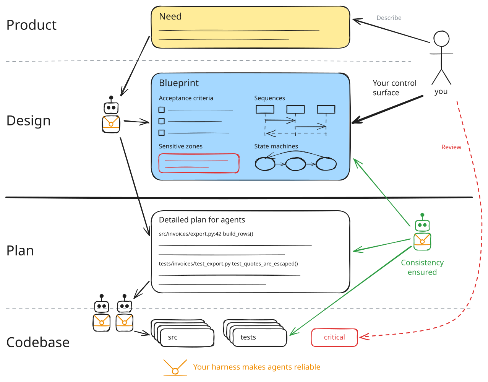
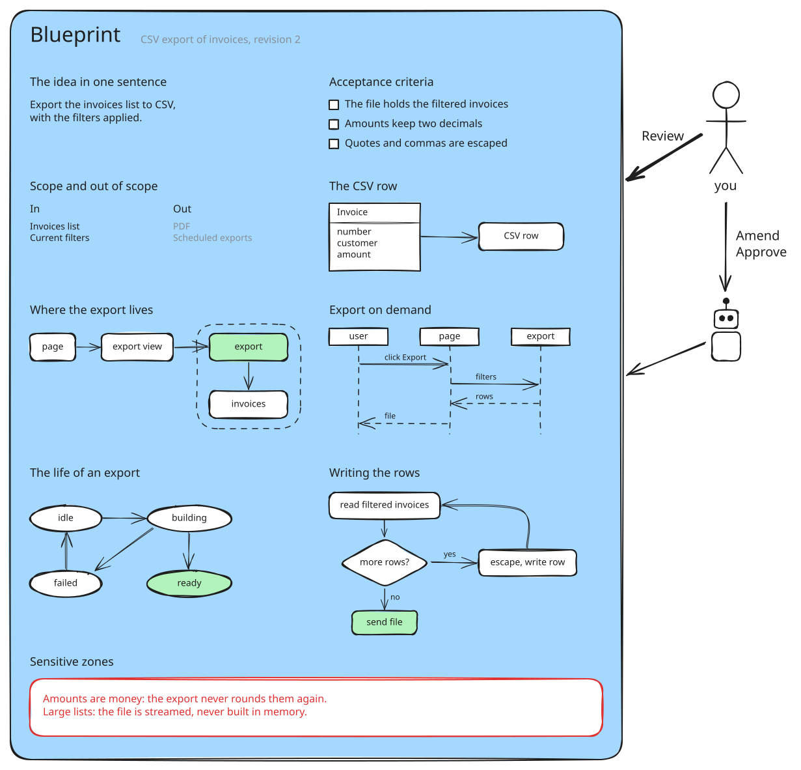
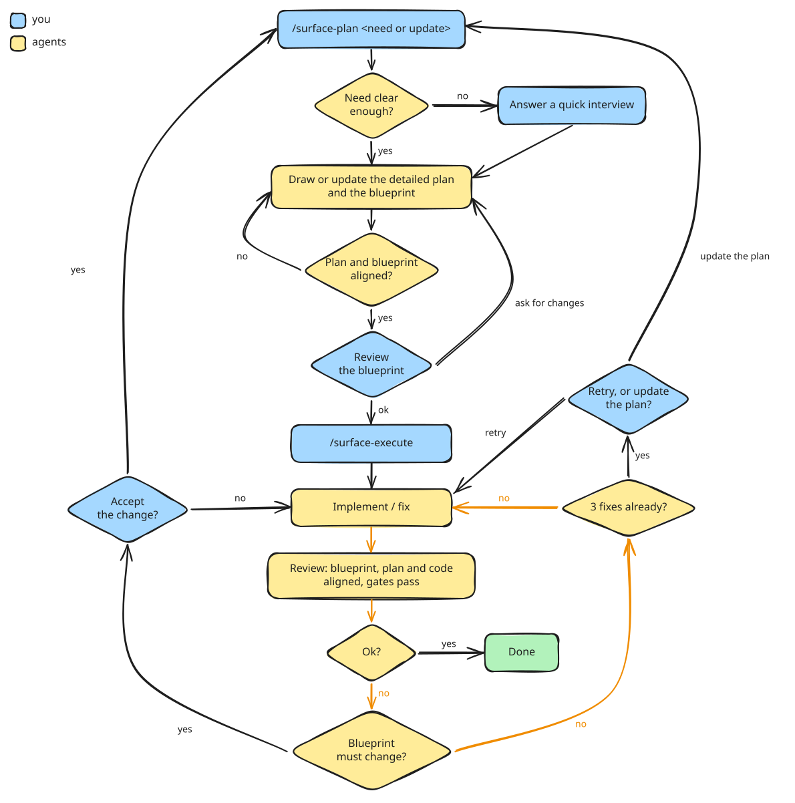

# Control Surface

**Steer from the right control surface, and let agents work where they are reliable.**

Approve the blueprint of your feature: every decision that matters, in a form you can read in full. Agents then build it and review their own work until it matches, without you reading the code.

<picture>
  <source media="(prefers-color-scheme: dark)" srcset="docs/images/layers-dark.svg">
  
</picture>

## Install

```sh
curl -fsSL https://raw.githubusercontent.com/PittsCraft/control-surface/main/install.py | python3 -
```

Run it at the root of your project. It needs Claude Code, git and Python 3.11 or newer, installs the chain in `.claude/`, and needs no configuration.

## The thesis

You could control higher, at the product specs: that is vibe coding. Or lower, in the code itself. With a strong enough harness, the blueprint is the right control surface.

- **You describe a need and control a blueprint.** The blueprint is the only thing you have to read, and the contract the work is judged against. It is frozen when you approve it.
- **Agents draw the detailed plan and build the code.** A fresh agent for each step, which reads files and never a conversation.
- **Consistency is ensured, not hoped for.** A cross-check proves the blueprint hides nothing the plan does. Reviews go on until the code matches the blueprint, each criterion with its proof. A change that would make the blueprint false comes back to you.
- **Your harness ensures discipline.** The harness is your project's own gates: its tests, lint, architecture and type checks... The loop runs them before every review and after every fix, and nothing goes on while one is red. The stronger your gates, the more you can delegate.
- **Where a mistake would cost you most, read the code yourself.** Declare your critical zones in your `AGENTS.md` or `CLAUDE.md`: the blueprint names those a plan touches, and when the work is conform the PR description lists the files changed there, for you to read.

## What you control

<picture>
  <source media="(prefers-color-scheme: dark)" srcset="docs/images/blueprint-dark.svg">
  
</picture>

The blueprint is as long as the feature needs and no longer, with a diagram wherever one is clearer than prose. It shows what will be built, never the order of construction: that stays in the plan.

You review it yourself. You never edit it by hand: you ask for a change in the conversation and an agent draws the next revision, and launching `/surface-execute` approves the one you read.

## What happens

<picture>
  <source media="(prefers-color-scheme: dark)" srcset="docs/images/algorithm-dark.svg">
  
</picture>

Two commands, and three moments when the hand comes back to you: the blueprint would have to change, the loop no longer converges, or the work is conform.

## Your gestures

| You | The chain |
|---|---|
| `/surface-plan <your need>` | explores the code, asks its questions one at a time, draws the plan and the blueprint, opens a draft PR |
| Read the blueprint, ask for changes | draws the next revision, and asks again |
| `/surface-execute` | takes it as your approval, then builds, runs your gates, reviews and fixes until conform |
| Decide, when the hand comes back | goes on from your answer |
| Mark the PR ready, merge | never does it for you |

`/surface-status` tells you where every plan stands, at any time. If a session dies, relaunch the same command: the whole state lives in your repository.

## Going further

- [Guide](docs/guide.md): every step in detail, permissions, the conformity check in your CI, settings, updates.
- [ARCHITECTURE.md](ARCHITECTURE.md): how the chain is built, and its invariants.
- [`docs/adr/`](docs/adr/README.md): the decisions whose history matters.
- [CONTRIBUTING.md](CONTRIBUTING.md): to work on the chain itself.

The diagrams are drawn with [Excalidraw](https://excalidraw.com): their sources are the `.excalidraw` files of `docs/images/`.

## License

MIT, see `LICENSE`.
