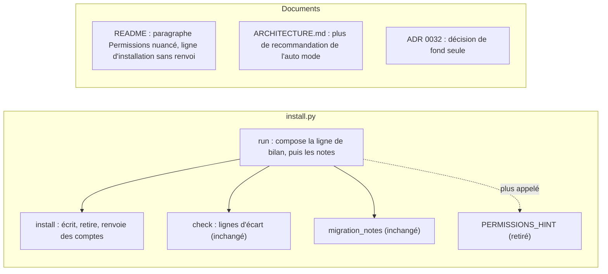
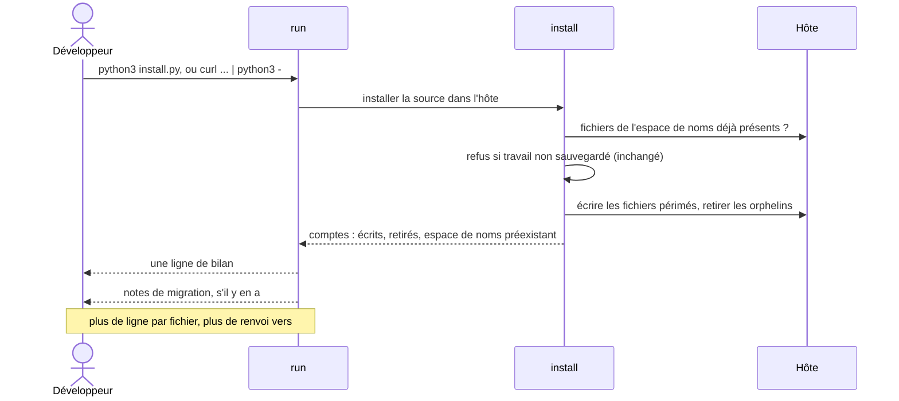
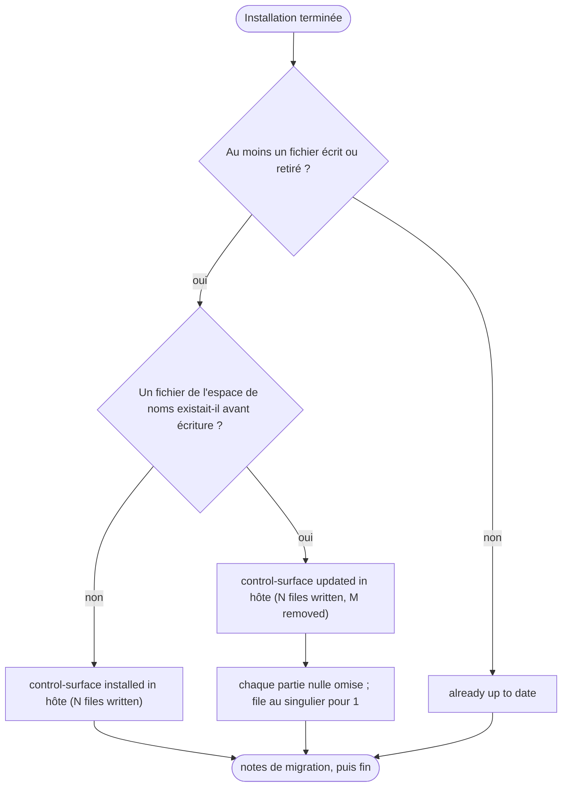

# Une installation sobre, des permissions nuancées : vue d'ensemble

Révision 1, tirée de `plan.md`. La page que le développeur lit pour approuver le travail, puis le contrat auquel le travail est jugé : figée à l'approbation. Ni l'ordre de construction ni la répartition des tests : ils appartiennent au plan.

## 1. L'idée en une phrase

L'installateur n'imprime plus qu'une ligne de bilan, sans liste de fichiers ni renvoi aux permissions, et le README cesse de recommander l'auto mode sans nuance.

## 2. Critères d'acceptation

1. Une installation ou une mise à jour réussie imprime une seule ligne de bilan, sans aucune ligne `written :` ou `removed :` par fichier :
   - rien d'installé auparavant dans l'espace de noms : `control-surface installed in <hôte> (<N> files written)` ;
   - une installation existante changée : `control-surface updated in <hôte> (<N> files written, <M> removed)`, chaque partie nulle omise, soit `(<N> files written)` ou `(<M> files removed)` ;
   - rien à changer : `already up to date`, comme aujourd'hui ;
   - `file` au singulier pour 1.
2. Les notes de migration restent imprimées, sous la ligne de bilan, comme aujourd'hui.
3. L'installateur n'imprime plus rien sur les permissions ni aucun lien vers le README, dans aucun cas, y compris quand tout est à jour.
4. La sortie du mode pipe (`curl ... | python3 -`) est identique à celle d'un clone pour le même hôte.
5. La section `### Permissions` du README devient un paragraphe sans encadré d'avertissement, qui constate puis laisse choisir. Texte retenu : « The loop runs until a command needs an approval your rules or mode do not give, then waits for you. How much it does alone is your call: auto mode on your machine, `bypassPermissions` only in a container or a VM you can throw away, or the default mode with your own allow rules. »
6. La ligne d'installation du README ne renvoie plus à la section Permissions ; elle garde que l'installateur n'écrit jamais les réglages Claude Code.
7. L'ADR 0032 ne décrit plus le texte du README ni un renvoi de l'installateur ; sa décision de fond (aucune règle de permission livrée ni vérifiée, aucun test sur la prose du README) reste intacte. `ARCHITECTURE.md` ne dit plus que le README recommande l'auto mode.

## 3. Périmètre et hors périmètre

Dans le périmètre : la sortie d'une installation ou d'une mise à jour réussie (`install.py`), la section Permissions et la ligne d'installation du README, le passage de `ARCHITECTURE.md` sur les permissions laissées au développeur, le paragraphe « Decision » de l'ADR 0032 (et sa phrase de « Consequences » s'il le faut).

Hors périmètre :

- le mode `--check` et sa sortie, ligne par écart ou `no drift` ;
- les messages d'erreur de l'installateur, dont les refus pour travail non sauvegardé et l'option `--force` ;
- le contenu des notes de migration ;
- la détection d'une installation lancée dans le clone de control-surface lui-même, évoquée par le texte collé dans la demande mais non demandée ;
- une option `--verbose` qui garderait la liste par fichier, et une ligne « Next: /surface-plan » : écartées ;
- les tests de bout en bout ;
- toute règle de permission livrée ou vérifiée : toujours aucune ;
- un nouvel ADR : l'ADR 0032 est allégé en place.

## 4. Schéma de données

Pas de changement de données persistées : aucun fichier nouveau, aucun fichier de réglages, l'espace de noms installé est le même.

Seule la forme d'un résultat interne change : la fonction `install` renvoie des comptes structurés (fichiers écrits, fichiers retirés, et si l'espace de noms existait avant écriture) au lieu de lignes de texte.

## 5. Architecture et frontières

La composition du message passe de `install` à `run` : `install` compte, `run` rédige la phrase. La constante `PERMISSIONS_HINT` et son commentaire disparaissent. `check` garde ses lignes, inchangé. Les trois documents (README, `ARCHITECTURE.md`, ADR 0032) sont réalignés sur l'installateur tel qu'il devient.

Décisions existantes qui continuent de s'appliquer : l'installateur n'écrit que dans son espace de noms et ne crée aucun fichier de réglages (ADR 0019) ; aucune règle de permission livrée ni vérifiée, aucun test sur la prose du README (ADR 0032) ; aucun tiret cadratin dans le dépôt.

## 6. Séquences

Une installation, depuis un clone ou en mode pipe, suit le même chemin et imprime la même sortie.

## 7. Machines à états

Aucun changement.

## 8. Algorithmes

Le choix de la ligne de bilan. « installed » contre « updated » se décide sur l'existence, avant écriture, d'au moins un fichier de l'espace de noms dans l'hôte, et non sur le nombre de fichiers écrits. Conséquence : une installation dont une partie des fichiers manque s'annonce « updated » ; une installation dont il ne reste aucun fichier s'annonce « installed ».

## 9. Zones sensibles

- La liste des fichiers écrits disparaît sans option pour la retrouver : pour savoir ce que l'installateur a touché, il reste `git status` dans l'hôte. Tout script qui lirait les lignes `written :` perdrait cette information ; dans le dépôt, seuls les tests d'installation lisent cette sortie.
- La forme exacte des phrases de bilan (critère 1) a été fixée par le plan, pas par vous : seul le principe d'une ligne de bilan avec les comptes a été tranché en interview.
- Le README nomme désormais `bypassPermissions`, avec la réserve « seulement dans un conteneur ou une VM jetable ». C'est la phrase qui touche le plus au contrôle du développeur sur sa machine, et aucun test ne la protège : la prose du README n'est vérifiée que par la relecture.
- L'ADR 0032 est réécrit en place, sans être marqué superseded ni remplacé : l'ancien texte ne survit que dans l'historique git.
- Le titre de section « Permissions » est gardé, pour ne pas casser d'éventuels liens entrants vers `#permissions`.
- La remarque du texte collé sur une installation lancée par erreur dans le clone de control-surface n'est pas traitée : l'installateur continuera d'écrire dans le dossier courant sans prévenir.
- Les copies installées non suivies de `.claude/skills/` et `.claude/agents/` dans ce dépôt doivent rester hors des commits.
