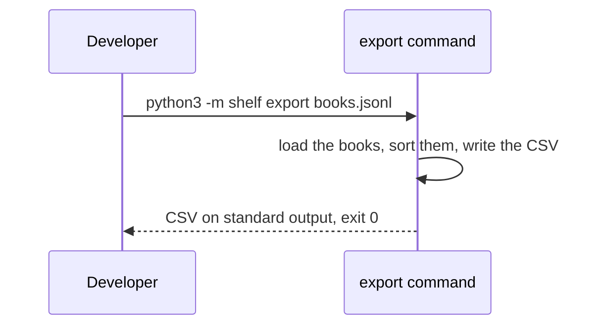

# Export the shelf as CSV: blueprint

Revision 1, drawn from `plan.md`.

## The idea in one sentence

A new command prints the books of a shelf file as CSV, for the bookshop's spreadsheet.

## Background

The bookshop wants to load our shelf into its spreadsheet. Spreadsheets read CSV, a text format
in which each line is a row and each field is separated by a comma. Our shelf is kept as a JSON
Lines file, which a spreadsheet does not read. This is why a command that prints the shelf as CSV
is needed: it lets the bookshop load the shelf into its spreadsheet. The command prints a header
line, then one line per book, with the title, the author and the year of each book.

## Acceptance criteria

1. `python3 -m shelf export <file>` prints the books of the file as CSV on standard output and
   exits with 0.
2. The first line is the header `title,author,year`.
3. One line per book: its title, author and year, in that order. The ISBN is not exported.
4. The lines are sorted by author, then by title.
5. Fields are quoted as Python's `csv` module does by default: only when they hold a comma, a
   quote or a line break.
6. An empty shelf prints the header alone.

## Scope and out of scope

Out of scope: any other format, writing to a file.

## The export command

The year is printed as the whole number the shelf file holds. Lines end with a line feed, not
with the carriage return and line feed Python's `csv` module writes by default: an assumption,
to confirm with the bookshop.

As said above, the columns are the title, the author and the year, in this order, and the ISBN is
not one of them: the CSV has three columns, and its lines are sorted by author, then by title.

## How the code works, step by step

1. `main` in `shelf/__main__.py` builds an `argparse` parser and adds a sub-parser named `export`
   with one positional argument, `path`, of type `Path`.
2. When `args.command` equals `"export"`, `main` calls `load(args.path)` and keeps the result in
   a local variable named `books`.
3. `to_csv` creates an `io.StringIO` buffer named `out` and a `csv.writer` named `writer` on it,
   with `lineterminator="\n"`.
4. `writer.writerow(HEADER)` writes the header, where `HEADER` is a module constant holding the
   tuple `("title", "author", "year")`.
5. A `for` loop goes over `sorted(books, key=lambda book: (book.author, book.title))` and calls
   `writer.writerow((book.title, book.author, book.year))` for each book.
6. `to_csv` returns `out.getvalue()`, and `main` passes it to `sys.stdout.write`, then returns 0.

## Testing strategy

The function `to_csv` gets unit tests in `tests/test_export.py`: one for the header, one for a
single book, one for the order of two books, one for a title holding a comma, one for an empty
list. The command gets a test in `tests/test_cli.py` that runs it on a temporary file. All the
tests run with `python3 -m unittest discover -s tests -q`, and all of them must pass.

## Sensitive zones

Critical zone touched: the CSV export (`AGENTS.md`). Its columns are a contract with the
bookshop, fixed by criteria 2 and 3.

No change: the data schema, the architecture and its boundaries, the state machines.
