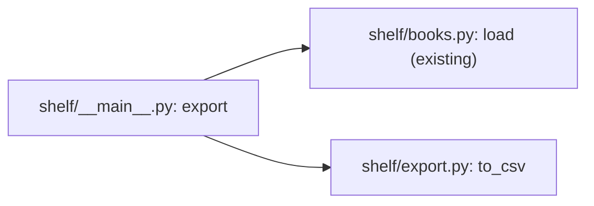

# Export the shelf as CSV: blueprint

Revision 1, drawn from `plan.md`.

## The idea in one sentence

A new command prints the books of a shelf file as CSV, for the bookshop's spreadsheet.

## Acceptance criteria

1. `python3 -m shelf export <file>` prints the books of the file as CSV on standard output and
   exits with 0.
2. The first line is the header `title,author,year`.
3. One line per book: its title, author and year, in that order.
4. The lines are sorted by author, then by title.

## Scope and out of scope

In scope: the `export` command and the CSV it prints. Out of scope: any other format,
writing to a file.

## The export command

`python3 -m shelf export <file>` loads the books of the file, sorts them by author, then by
title, and prints the CSV on standard output: the header, then one row per book.

The CSV has three columns, in this order:

| Column | From | Form |
|---|---|---|
| `title` | `Book.title` | text |
| `author` | `Book.author` | text |
| `year` | `Book.year` | whole number |

`to_csv` is pure: a list of books in, the CSV text out. Standard library only.

## Sensitive zones

Critical zone touched: the CSV export (`AGENTS.md`). Its columns are a contract with the
bookshop: their names and their order are fixed by this blueprint.

No change: state machines.
